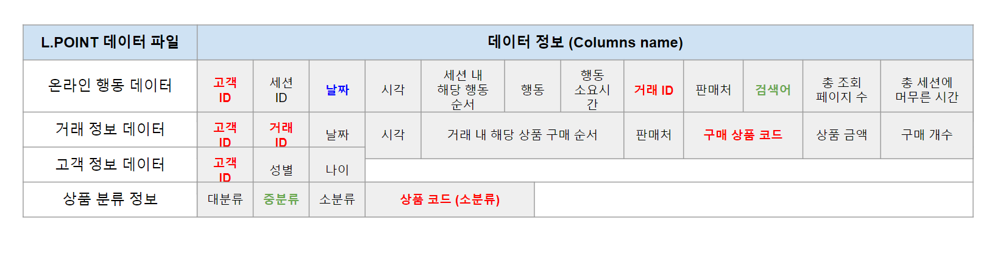

# L.Point 추천 시스템

진행 정보: 완료, 팀

### **왕밤빵 팀 구성**

| 이름   |  구성   |                      역할                  |
| :----: | :----: |  :---------------------------------------: | 
| 박기민   |  팀장   | 데이터 정제 및 생성, User2Vec 모델 구현   | 
| 이상운  |  팀원   | Wide & Deep 모델 구현, 외부 데이터 수집   | 
| 차나래  |  팀원   | 평가지표 개발 및 성능 개선, 결과 시각화  | 
| 장선우  |  팀원   | 데이터 EDA 및 데이터 분석, PPT 작성 | 

 

### **작업 환경**

- Ubuntu 18.04
- Intel i7-10875H
- GeForce RTX 2070 / RAM 8GB
- Jupyter notebook

### **Skills**

- python 3
- numpy 
- pandas
- selenium
- tensorflow
- matplotlib

## 🗒️ Content

---

### □ **데이터 정보**

- **온라인 행동 정보** : 업종별로 고객들의 온라인 행동 정보
- **거래 정보**  : 온,오프라인 업종별로 고객들의 구매 정보
- **고객 Demographic 정보** : 고객들의 id와 성별, 연령대 정보
- **상품 분류 정보** : 상품 정보 (대분류, 중분류, 소분류 등)

### □ **프로젝트 진행 요약**

| 기간   |                     활동                   |   장소  |
| :----: | :--------------------------------------- |  :------: | 
| 1주차	 |  프로젝트 기획 및 목표 선정, 워크플로우 논의   | 오프라인   | 
| 2주차  |  Raw Data 분석, 추천 시스템 모델 논의   | 오프라인| 
| 3주차  |   추천 시스템 논문 Review, 고객 유형 분석  | 오프라인  | 
| 4주차  | 애자일소다 Kick-off 미팅, 추천 알고리즘 모델 생성 논의|온라인| 
| 5주차  |   LightGBM 기반 Baseline 작성, Feature Selection 논의  | 온라인 | 
| 6주차  |  추천시스템 평가지표 학습, EDA 추가 수행   | 온라인 | 
| 7주차  |  모델 평가 방식 논의, User2Vec 논의   | 온라인 | 
| 8주차  |  Wide&Deep 모델 수행, 데이터 엔지니어링   | 온라인 | 
| 9주차  |   결과 시각화, 모델 개선과 실험  | 온라인 | 
| 10주차 |   PPT 작성, 최종 발표  | 온라인 | 
- 코로나 상황 악화에 따라 4주차부터 Google meet을 활용하여 온라인 미팅으로 프로젝트 진행.

 

## 📒 진행 과정

---

## Overview

### □ Purpose

- 고객의 행동 데이터를 기반으로 상위 K개 제품을 추천.

### □ Structure

- Input 데이터 : L.Point 데이터 + 생성 데이터 + 임베딩 데이터 + 외부 데이터
- Model : Wide & Deep Model
- 평가 지표 : MAP, Entropy-Diversity

## Process

### □ [EDA](https://github.com/PEBpung/Lpoint-Hackathon/blob/master/src/02.%EB%8D%B0%EC%9D%B4%ED%84%B0_EDA.ipynb)

- 온라인 행동 유형 시각화

    

    - 결제 시도와 구매 완료의 많은 양의 데이터 수 차이 존재
    - 결제 시도 과정에서 다량의 중복 데이터가 확인

- 일자별 활동량 추이

    

    - 일자 별 활동량을 그래프로 시현
    - 요일 별 유사패턴이 확인, 요일 Feature 추가 고려
    - 2019-09-15 부근의 급격한 하락은 추석 명절에 따른 영향으로 분석

- 고객 분포

    

    - 고객의 성별은 여성이 84.5%로 다수 분포
    - 고객의 나이는 30대가 35.2% 40대가 40.4%로 다수 분포.
    - 30대~40대 여성 성향에 따른 구매 품목 다수에 영향이 있을 것으로 판단.

### □ [Keyword Crawling](https://github.com/PEBpung/Lpoint-Hackathon/blob/master/src/00.Sech_kwd_%EB%A7%A4%ED%95%91.ipynb)

- 온라인 행동 데이터는 "검색, 목록, 세부정보, 장바구니 추가, 장바구니 선택, 결제 시도, 구매 완료, 결재 옵션" 8가지 행동 중 
  오직 "구매"  데이터에만, trans_id 값이 존재하여, 다른 행동이 어떤 상품에 대한 행동인지 유추하기 어려운 문제가 있음
- "검색" 행동 데이터의 "검색 키워드(sech_kwd)"를 활용하여 상품을 유추하는 방안 계획
    1. 검색 키워드 값을 롯데홈쇼핑 메인 페이지 검색창에 검색
    2. 결과로 나오는 상품 분류명을 scraping하여 해당 상품 유추
    3. scraping 한 상품 분류명을 매칭되는 상품 분류 정보의 "중분류명(clac_nm2)"으로 변경

### □ [Data Generator](https://github.com/PEBpung/Lpoint-Hackathon/blob/master/src/04.feature_%EC%83%9D%EC%84%B1.ipynb)

1. 누적 행동 데이터 생성

    

    - 기존 데이터는 고객의 과거 행동 이력을 반영하고 있지 않음.
    - 행동 변수를 dummy화 시킨 후, 동일 Session 내에서 특정 행동의 빈도를 누적.

2. 최근 행동 데이터

    

    - 고객의 행동 패턴 반영을 위하여 최근 행동 데이터에는 고객이 최근 활동한 시간과 서핑 속도를 반영.

3. 선호 채널과 기기

    

    - 시각화 결과 같은 기기라도 유입채널이 다르면 다른 분포를 가지고 있음.
    - 두 변수를 결합하여 선호하는 경로를 데이터에 반영.

### □ [User2Vec](https://github.com/PEBpung/Lpoint-Hackathon/blob/master/src/05.User2Vec_%ED%95%99%EC%8A%B5.ipynb)

User2Vec을 활용하여 같은 품목을 구매한 User들의 상관관계를 분석.

- 유사한 상품에 대하여 Cosine Similarity값이 상대적으로 높은 것을 확인.

### □ [Feature Selection](https://github.com/PEBpung/Lpoint-Hackathon/blob/master/src/04.feature_%EC%83%9D%EC%84%B1.ipynb)

Feature engineering과 User2Vec을 마친 후, Feature의 중요도(Importance)에 대한 시각화 수행.

- 모델에 적용할 Input Feature 선택 시, Feature Importance 수치를 반영하여 상대적으로 낮은 수치의 Feature는 Input Data에서 제외함.

### □ [Model](https://github.com/PEBpung/Lpoint-Hackathon/blob/master/src/07.Wide%26Deep_%EB%AA%A8%EB%8D%B8_%ED%95%99%EC%8A%B5-all.ipynb)

- Wide model과 Deep Model이 결합된 형태인 Wide & Deep 모델을 사용

- Wide 모델의 경우 Categorical Feature에 대하여 Cross Product 수행하여 새로운 Feature 생성.
- Deep 모델의 경우 Continuous Feature와 Categorical Feature를 Embedding 하여 복합 적용.

### □ [Evaluation]](https://github.com/PEBpung/Lpoint-Hackathon/blob/master/src/07.Wide%26Deep_%EB%AA%A8%EB%8D%B8_%ED%95%99%EC%8A%B5-all.ipynb)

- 모델 평가를 위하여 mAP(Mean Average Precision), Entropy-Diversity 평가 지표를 활용
- 모델이 예측 점수가 높은 상품에 대하여 우선적으로 추천을 수행하므로, 상위 추천 아이템의 구매가 이루어졌을 때, 더 높은 점수를 부여할 수 있는 mAP 지표 활용.
- 구매 history가 절대적으로 많은 데이터에 제한되어 추천이 발생하지 않았는지, 즉 추천 아이템의 다양성에 대한 확인을 위하여, Entropy-Diversity 지표 활용.

- mAP(Mean Average Precision)

    

- Entropy-Diversity

    

## 🏆 해커톤 결과

---

- **심사 위원** : 애자일소다 최대우 대표님, AIFFEL 이지석 교장선생님, AIFFEL 퍼실리테이터님들
- 중간 발표와 최종 발표 합산 결과 **우수상** 수여
